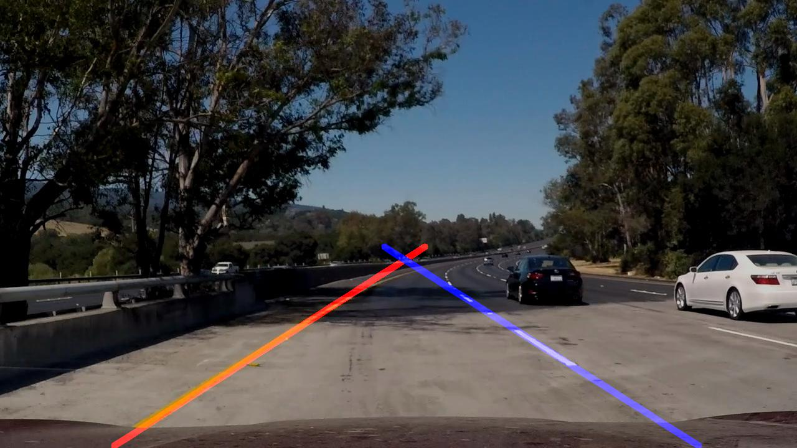

# **Finding Lane Lines on the Road** 

## Overview
---

This repository is my solution to the Finding Lanes on the Road project of the Udacity Self-Driving Car Nanodegree Program. The  FindingLanesInSingleVideo.py script takes a video finds lane lines in it and outputs a video with the discovered lane lines augmeneted on the original video.

## Usage
---

There is to ways to runthe code:

Either open the junyper notebook in the project directory

`> cd <path to the project directory>>`
`> jupyter notebook	findingLanes.ipynb`

Or open the FindingLanesInSingleVideo.py in your python IDE. The video to be processed is hard coded at the moment and can be changed in the code directly.

If you want to run the proces on the challenge.mp4 you can simply execute the script.

---

## License
The project is published using the MIT license

