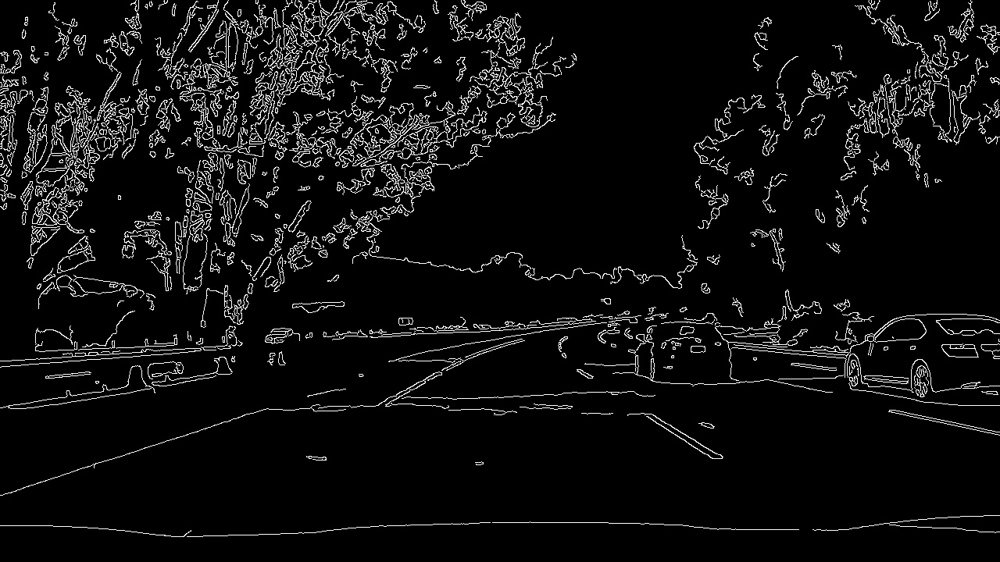

# **Finding Lane Lines on the Road** 

## Writeup

---

**Finding Lane Lines on the Road**

The goals / steps of this project are the following:
* Make a pipeline that finds lane lines on the road
* Reflect on your work in a written report


[//]: # (Image References)

[image1]: ./examples/grayscale.jpg "Grayscale"

---

### Reflection

### 1. Pipeline

**I/O**

Aside from the processing part other the pipeline needs to solve other problems
  - Load a video
  - Extract single frames
  - Combine processed frames to new video file

Load video:
The video file is defined and opened using cv2.VideoCapture.
```python
#video = "challenge.mp4"
video="solidYellowLeft.mp4"
#video="solidWhiteRight.mp4"
vidcap = cv2.VideoCapture(video)
success,image = vidcap.read()
```
While the reader is successfully reading more images from the video stream, each extracted frame is processed and added to the output stream. 

**Preprocessing**

The actual work is done within the findLaneLines(image) function, which takes an image as an agument and returns the processed image.

The ideal colorspace for detecting yellow and white lane lines is not BRG. This is why the original image is converted to color spaces, that work better for white and yellow lines respectively. For the white lines a gray scale image is chosen for the yellow lines it is converted to LAB color space.
```python
lab = cv2.cvtColor(image,cv2.COLOR_BGR2LAB)
gray = cv2.cvtColor(image,cv2.COLOR_BGR2GRAY)
```
    


```python
success = True
while success:
    success,image = vidcap.read()
    print("processing Frame "+count)
    count=count+1
    if (init):
        writer = cv2.VideoWriter(video.replace(".mp4","_processed.mp4"),fourcc, fps, (image.shape[1],image.shape[0]))
        init=bool(0)
    if (success):
        writer.write(findLaneLines(image))
    else:
        writer.release()
```
For later filtering the images are used to create masks, where all but the whitest and most yellow regions of the image are set to zero.
```python
   white_threshold=np.array([175],dtype="uint8")
    yellow_threshold=np.array([50, 0, 150],dtype="uint8")
    upperb_white=np.array([255],dtype="uint8")
    upperb_yellow=np.array([255,150,255],dtype="uint8")
    white_mask=cv2.inRange(gray,white_threshold,upperb_white)
    yellow_mask=cv2.inRange(lab,yellow_threshold,upperb_yellow)
```

   

Before edges can be extracted from the image the gray scale image is smoothed and the B-Channel from the LAB-image is extracted and normalized. The blur reduces the sharpness in the image, which supresses edge detection from samll objects or noise. The B-Channel from the LAB-image contains most of the information about yellow color. Extracting a single Channel reduces the contrast by a factor of 3. Therefore the image needs to be normalized in order to get sufficient contrast for edge detection.

```python
blur_gray = cv2.GaussianBlur(gray,(kernel_size, kernel_size),0)
normalizedImg=cv2.normalize(lab[:,:,2],np.zeros_like(lab[:,:,2]), 0, 255, cv2.NORM_MINMAX)
```
 

The blurred and normalized Imageas are now used to extract the respective edges and merged into one image.
```python
edges = cv2.Canny(blur_gray, low_threshold, high_threshold)
edges=cv2.bitwise_or(cv2.Canny(normalizedImg, 30, 180),edges)
```
   


### 2. Identify potential shortcomings with your current pipeline


One potential shortcoming would be what would happen when ... 

Another shortcoming could be ...


### 3. Suggest possible improvements to your pipeline

A possible improvement would be to ...

Another potential improvement could be to ...
