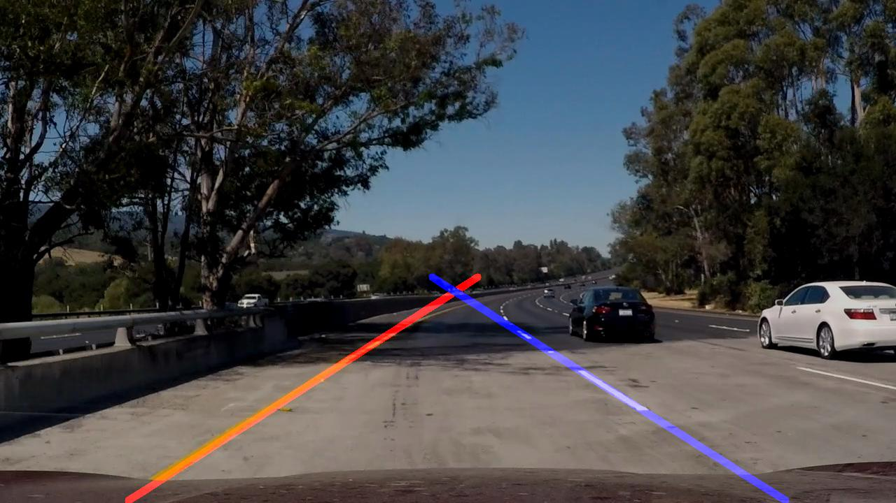

# **Finding Lane Lines on the Road** 

## Writeup

---

**Finding Lane Lines on the Road**

The goals / steps of this project are the following:
* Make a pipeline that finds lane lines on the road
* Reflect on your work in a written report


[//]: # (Image References)

[image1]: ./examples/grayscale.jpg "Grayscale"

---

### Reflection

### 1. Pipeline

**I/O**

Aside from the processing part the pipeline needs to solve other problems
  - Load a video
  - Extract single frames
  - Combine processed frames to new video file

Load video:
The video file is defined and opened using cv2.VideoCapture.
```python
#video = "challenge.mp4"
video="solidYellowLeft.mp4"
#video="solidWhiteRight.mp4"
vidcap = cv2.VideoCapture(video)
success,image = vidcap.read()
```
While the reader is successfully reading more images from the video stream, each extracted frame is processed and added to the output stream. 


```python
success = True
while success:
    success,image = vidcap.read()
    print("processing Frame "+count)
    count=count+1
    if (init):
        writer = cv2.VideoWriter(video.replace(".mp4","_processed.mp4"),fourcc, fps, (image.shape[1],image.shape[0]))
        init=bool(0)
    if (success):
        writer.write(findLaneLines(image))
    else:
        writer.release()
```

**Preprocessing**

The actual work is done within the findLaneLines(image) function, which takes an image as an agument and returns the processed image.

The ideal colorspace for detecting yellow and white lane lines is not BRG. This is why the original image is converted to color spaces, that work better for white and yellow lines respectively. For the white lines a gray scale image is chosen for the yellow lines it is converted to LAB color space.
```python
lab = cv2.cvtColor(image,cv2.COLOR_BGR2LAB)
gray = cv2.cvtColor(image,cv2.COLOR_BGR2GRAY)
```
    


**Segmentation**

For later filtering the images are used to create masks, where all but the whitest and most yellow regions of the image are set to zero.
```python
   white_threshold=np.array([175],dtype="uint8")
    yellow_threshold=np.array([50, 0, 150],dtype="uint8")
    upperb_white=np.array([255],dtype="uint8")
    upperb_yellow=np.array([255,150,255],dtype="uint8")
    white_mask=cv2.inRange(gray,white_threshold,upperb_white)
    yellow_mask=cv2.inRange(lab,yellow_threshold,upperb_yellow)
```

   

Before edges can be extracted from the image the gray scale image is smoothed and the B-Channel from the LAB-image is extracted and normalized. The blur reduces the sharpness in the image, which supresses edge detection from samll objects or noise. The B-Channel from the LAB-image contains most of the information about yellow color. Extracting a single Channel reduces the contrast by a factor of 3. Therefore the image needs to be normalized in order to get sufficient contrast for edge detection.

```python
blur_gray = cv2.GaussianBlur(gray,(kernel_size, kernel_size),0)
normalizedImg=cv2.normalize(lab[:,:,2],np.zeros_like(lab[:,:,2]), 0, 255, cv2.NORM_MINMAX)
```
 

The blurred and normalized images are now used to extract the respective edges and merged into one image.
```python
edges = cv2.Canny(blur_gray, low_threshold, high_threshold)
edges=cv2.bitwise_or(cv2.Canny(normalizedImg, 30, 180),edges)
```
   

In order to deal with arbitrary lane types spacial filtering is applied to handle image regions where left lane lines are suspected independently from the right-hand-side counterpart. Therefore polygons are created that define the regions of interest.

```python
ysize = image.shape[0]
xsize = image.shape[1]

left_left_top=[xsize*(0.5-dx),ysize*upppery]
left_right_top=[xsize*(0.50-gap),ysize*upppery]
left_left_bottom=[xsize*dx,ysize*lowery]
left_right_bottom=[xsize*(0.5-2*gap),ysize*lowery]

right_left_top=[xsize*(0.5+gap),ysize*upppery]
right_right_top=[xsize*(0.5+dx),ysize*upppery]
right_left_bottom=[xsize*(0.5+2*gap),ysize*lowery]
right_right_bottom=[xsize*(1-dx),ysize*lowery]
#Create polygons from corners
left_vertices = np.array([[left_left_top,left_right_top, left_right_bottom, left_left_bottom]], dtype=np.int32)
right_vertices = np.array([[right_left_top,right_right_top, right_right_bottom, right_left_bottom]], dtype=np.int32)
#Set marks as areas within the polygons
cv2.fillPoly(left_mask, left_vertices, ignore_mask_color)
cv2.fillPoly(right_mask, right_vertices, ignore_mask_color)
```

In the next step we check if the right or left regions contain yellow lane lines. Therefore whe the use priorly created color and region masks. Ich a threshold amount of pixels are yellow in each region, it is assumed, that the lane line on that side is yellow. The region filters are applied to the adge images accordingly.
```python
#check if lane lines are white or yellow
countYellowLeft=cv2.countNonZero(cv2.bitwise_and(yellow_mask, left_mask))
countYellowRight=cv2.countNonZero(cv2.bitwise_and(yellow_mask, right_mask))
left_yellow=(countYellowLeft>minYellow)
#print("Left: Yellow Count: ", countYellowLeft)
right_yellow=(countYellowRight>minYellow)
#print("Right Yellow Count: ", countYellowRight)
if(left_yellow):
    left_masked_edges = cv2.bitwise_and(yellow_edges, left_mask)
else:
    left_masked_edges = cv2.bitwise_and(white_edges, left_mask)
if(right_yellow):
    right_masked_edges = cv2.bitwise_and(yellow_edges, right_mask)
else:
    right_masked_edges = cv2.bitwise_and(white_edges, right_mask)
```

 

**Detect and draw Lane Lines**

The images are now sufficiently segmented to run the Hough line detector an them.
```python
    left_lines = cv2.HoughLinesP(left_masked_edges, rho, theta, threshold, np.array([]),
                                    min_line_length, max_line_gap)
    right_lines = cv2.HoughLinesP(right_masked_edges, rho, theta, threshold, np.array([]),
                                    min_line_length, max_line_gap)
```
The results are start and end points of the detected lines. In order to get a polynomial function to inter- and extrapolate the lines we require points. Thus the X- and Y-components of the lines are extracted. The points are initially used to extract a 2nd degree poly for better approximation of curved lanes. If the rank of the poly is to low we fall back on a 1st degree poly. Finally the approximated/interpolated/extrapolated are drawn to an empty image. This process is done for each side.
```python
# Iterate over the output "lines" and draw lines on a blank image
    x=[]
    y=[]
    if(left_lines is None):
        print("No left_lines detected! Yellow: "+str(right_yellow))
    else:
        for line in left_lines:
            for x1,y1,x2,y2 in line:
                x.append(x1)
                y.append(y1)
                x.append(x2)
                y.append(y2)
    
        poly=np.polyfit(y,x,2)
        if(np.ndim(poly)<2):
            poly=np.polyfit(y,x,1)
            p = np.poly1d(poly)
        y = np.arange(ysize*upppery, ysize*(lowery), 10)
        x=p(y)
        i=0
        for xi in x:
            cv2.line(line_image,(int(round(xi)),int(round(y[i]))),(int(round(x[i+1])),int(round(y[i+1]))),(255,0,0),10)
            i=i+1
            if i+1==len(x):
                break
```

The resulting lines are stacked onto the original image and returned.
```python
lines_edges = cv2.addWeighted(image, 0.8, line_image, 1, 0) 
    return lines_edges;
 ```
 
 

### 2. Shortcomings 

First of all the python script needs to take an argument, which sets the video path and maybe an optional argument to specify the output path/name. Having to edit the source code in order to use another file makes the code unuseable.

The code is very inefficient and takes a long time to execute. It is not useable in real-time and embedded devices with lower processing power.

The lane lines are displayed rater jittery and occasionally none can be calculated. In one frame in the challenge.mp4 the right lane line is even calculated incorrectly.

### 3. Suggest possible improvements to your pipeline

As mentioned, a video path argument needs to be implemented.

In order to make the code more efficient the decision if there are yellow lines needs to be made earlier to avoid unnecessary operations.

The fact that we are using a series of images that are very similar needs to be exploited. The calculated polies from the predecessing images can be used to further decrease the ROI, and use exponential smoothing to smoothe the augmentation and reject polies that are too different from the prior ones. Also the prior poly can be used if single calculations fail.
